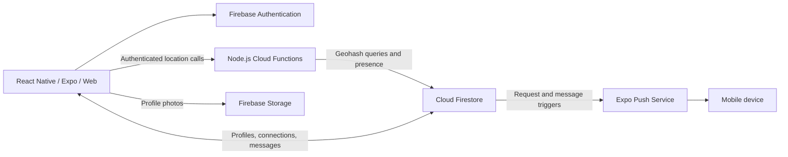

# Social Cards | Campus Icebreaker

A University of Wisconsin-Milwaukee computer science capstone built by Trever Fuhrer, Samuel Gaudet, Solomon Yang, Ignacio Vega Rivera, Lauren Knutson, and Jersemy De Jesus.

**Meet nearby classmates. Break the ice. Take the conversation offline.**

Social Cards is a React Native + Firebase app for discovering students within roughly 300 feet, exchanging connection requests, and starting a conversation through a 24-hour chat window.

**My role: original concept, location services, notifications, and onboarding.** I built the device-to-cloud location pipeline and notification features, improved registration flows, and resolved bugs involving stale presence and deleted accounts.

**TypeScript · React Native · Expo · Node.js · Firebase · Geospatial queries · Automated testing**

[My engineering contributions](#my-engineering-contributions) · [Architecture](#architecture) · [Run locally](#run-locally) · [Team](#team)

## My engineering contributions

### Location services across mobile and web

Implemented native location updates with Expo Location and Task Manager, plus browser geolocation and periodic foreground updates. The backend authenticates location pings, validates coordinates and timestamps, stores geohash-indexed presence, and filters nearby results by distance and freshness.

The difficult part was handling noisy GPS readings and users who moved away or logged out. I added bounded accuracy buffers, ping throttling, presence freshness checks, and session-exit cleanup to improve discovery behavior without treating old locations as current activity.

**Explore:** [location client](src/location/service.ts) · [backend handlers](backend/src/handlers.js) · [geospatial helpers](backend/src/helpers.js) · [session cleanup](src/auth/session.ts)

### Notifications that follow the conversation

Implemented push-token registration, permission handling, and connection-request and message notifications. Firestore triggers send mobile notifications through Expo's push service; the web client uses browser notifications or in-app alerts. Added suppression while the user is already viewing messages to avoid redundant interruptions.

**Explore:** [push delivery](backend/src/notifications.js) · [web notification coordinator](src/notifications/NotificationCoordinator.tsx) · [notification routing logic](src/notifications/runtime.ts)

### Onboarding, reusable UI, and backend tests

Contributed to the initial Firebase integration and authentication flow, improved registration validation, and built reusable buttons, signup headers, and progress indicators. Reworked hobby selection and persisted signup drafts so progress survives navigation and reloads. Added backend unit tests for location validation, stale data, throttling, authentication, and response formatting.

**Explore:** [signup draft persistence](src/signup/context.tsx) · [hobby selection](app/%28auth%29/signup/hobbies.tsx) · [UI components](src/components) · [backend tests](backend/tests/test.js)

## What the app does

- **Student onboarding:** `.edu` email registration, email verification, academic details, hobbies, icebreaker answers, avatars, and profile photos.
- **Nearby discovery:** social cards for active users in a nominal 300-foot radius, with GPS accuracy buffering.
- **Connections and chat:** accept or decline requests, view connection history, and exchange real-time messages during a 24-hour window enforced by the client.
- **Profile controls:** edit profile details and choose which fields appear before connecting; photos and last names are hidden by default in the UI.
- **Account and interaction controls:** block or report users, reset passwords, log out, and delete accounts with backend data cleanup.

The goal is to make introductions easier and encourage students to continue the relationship in person.

## Architecture



| Layer | Implementation |
| --- | --- |
| Client | TypeScript, React Native, Expo SDK 54, Expo Router, React Native Web |
| Device integration | Expo Location, Task Manager, Notifications, and Image Picker |
| Backend | Node.js 22, Firebase Cloud Functions, Firebase Admin SDK, `geofire-common` |
| Data and identity | Firebase Authentication, Cloud Firestore, Storage, and Firestore access rules |
| Testing and teamwork | Node's test runner, Jest, React Native Testing Library, Figma, Trello, and GitHub |

Screens live in [`app/`](app); domain services and shared components live in [`src/`](src). The [`backend/`](backend) contains callable functions, notification triggers, and geospatial helpers. Raw presence records are restricted to backend access by the [Firestore rules](firestore.rules).

## Run locally

Use Node.js 22 and npm. The app requires a configured Firebase project; cloning the repository alone does not provision its backend.

### 1. Install

```bash
git clone https://github.com/TreverFuhrer/Social-Cards.git
cd Social-Cards
npm ci
npm ci --prefix backend
```

### 2. Configure Firebase

Create a `.env` file at the repository root using the web app configuration from your Firebase project:

```dotenv
EXPO_PUBLIC_FIREBASE_API_KEY=your-api-key
EXPO_PUBLIC_FIREBASE_AUTH_DOMAIN=your-project.firebaseapp.com
EXPO_PUBLIC_FIREBASE_PROJECT_ID=your-project-id
EXPO_PUBLIC_FIREBASE_STORAGE_BUCKET=your-storage-bucket
EXPO_PUBLIC_FIREBASE_MESSAGING_SENDER_ID=your-messaging-sender-id
EXPO_PUBLIC_FIREBASE_APP_ID=your-app-id
EXPO_PUBLIC_FIREBASE_MEASUREMENT_ID=your-measurement-id
```

Enable email/password Authentication, Firestore, and Storage. With the Firebase CLI installed and authenticated, select your project and deploy the supplied backend configuration:

```bash
firebase use --add
firebase deploy --only functions,firestore
```

The client calls functions in `us-central1`. Configure Storage access for authenticated profile-photo uploads and add your development host to Authentication's authorized domains. For the custom verification/reset page, deploy Firebase Hosting and adapt the [email verification setup](docs/firebase-email-verification.md) to your project.

The copied `app.json` retains the team's Expo owner and EAS project ID. Configure your own Expo project and push credentials when building independently.

### 3. Start the client

```bash
npm run web
```

For mobile development, run `npm start` or use `npm run ios` / `npm run android` with the appropriate native toolchain. Native background location and push depend on device permissions and build configuration; push-token registration requires a physical device. The web client uses foreground browser geolocation and browser notifications or in-app alerts.

To explore the main flow, create and verify two `.edu` accounts, allow location access on nearby devices, send and accept a connection request, then open chat.

## Testing and project status

```bash
# Backend unit tests
npm test --prefix backend

# Client test suite, without watch mode
npm test -- --watchAll=false

# Client lint checks
npm run lint
```

Copy verification: **13/13 backend tests pass**, and **client lint passes**. The client suite includes registration, login, and password-recovery tests, but currently stops during `jest-expo` preset initialization before any tests execute, including under Node.js 22. The copied dependencies pair `jest-expo` 47 with Expo SDK 54; the client test setup needs updating.

The team's [peer-testing guide](Group3_PeerTestingInstructions.pdf) documents manual scenarios for discovery, connections, messaging, blocking, reporting, profile editing, and account lifecycle behavior.

This is an academic prototype. Mobile device behavior and live Firebase integration require separate end-to-end verification. The 24-hour chat restriction currently lives in the client; enforcing expiry in Firestore rules is a useful next step before a production release.

## Team

We developed the project through shared design discussions, task planning in Trello, GitHub branches and pull requests, and twice-weekly in-person work sessions. Contributions overlapped; the table summarizes each person's main areas from our final report and presentation.

| Contributor | Main contributions |
| --- | --- |
| **Trever Fuhrer** | Original concept; location services; notifications; Firebase/authentication setup; onboarding, hobby selection, reusable UI, backend tests, and bug fixes |
| **Samuel Gaudet** | Original repository; registration backend; photo upload; profile editing/viewing; connections; blocking/reporting; email verification |
| **Solomon Yang** | Messaging; password recovery; logout; account deletion; registration data handling; connection and account fixes |
| **Ignacio Vega Rivera** | Screen scaffolding and navigation; registration and settings; profile styling; camera capture and photo cropping; refactoring and bug fixes |
| **Lauren Knutson** | Figma/UI design; icebreaker prompts; avatar artwork and selection; registration navigation; settings styling; 404 page |
| **Jersemy De Jesus** | Figma/UI design; onboarding and registration styling; social cards; profile-photo and messaging screens; input usability improvements |

## Repository history

This portfolio copy preserves the [original team repository](https://github.com/sngaudet/Social-Cards), all 11 original branches, and all 239 available original commits with their authors, timestamps, and hashes intact. The `archive/original-pr-61` tag retains one commit reachable only through the original repository's pull-request reference. The rewritten README is a new commit on top of the original `main` history.
